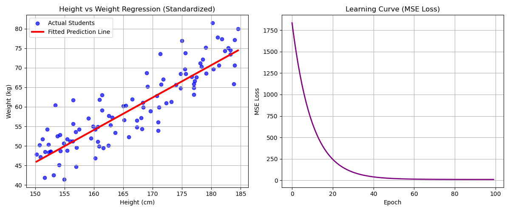

# 線形回帰 (Linear Regression) From Scratch

本ディレクトリでは，連続値を予測する最も基本的な教師あり学習アルゴリズムである **線形回帰 (Linear Regression)** を，NumPyを用いて完全にスクラッチで実装しています．

---

## アルゴリズムの概要

線形回帰は，入力特徴量 $X$ とターゲット $y$ の間に線形な関係を仮定し，以下の予測式でモデル化します．

$$y_{pred} = w \cdot X + b$$

ここで，$w$ は重み（傾き），$b$ はバイアス（切片）です．

### 1. 損失関数 (Loss Function)
モデルの予測値と実際の正解値とのズレを測定するため，**平均二乗誤差 (Mean Squared Error: MSE)** を使用します．数式は以下の通りです．

$$Loss = \frac{1}{2N} \sum_{i=1}^{N} (y^{(i)} - y^{(i)}_{pred})^2$$

### 2. パラメータの更新規則 (勾配降下法)
損失関数を最小化するために，重み $w$ とバイアス $b$ に対する偏微分（勾配）を手動で計算し，**勾配降下法 (Gradient Descent)** によりパラメータを更新します．

$$\frac{\partial Loss}{\partial w} = -\frac{1}{N} \sum_{i=1}^{N} X^{(i)} \cdot (y^{(i)} - y^{(i)}_{pred})$$

$$\frac{\partial Loss}{\partial b} = -\frac{1}{N} \sum_{i=1}^{N} (y^{(i)} - y^{(i)}_{pred})$$

更新ルール（学習率を $\eta$ とします）：

$$w \leftarrow w - \eta \cdot \frac{\partial Loss}{\partial w}$$

$$b \leftarrow b - \eta \cdot \frac{\partial Loss}{\partial b}$$

---

## データセットについて

本実装では，現実的な関係性をシミュレートした以下の人工データセットを作成して使用しています．

- **特徴量 (X)**: 150cm から 185cm までの身長データ（100人分）．
- **ターゲット (y)**: 以下の関係式に，体格差を表す適度なガウスノイズ（平均0，標準偏差5kg）を加えた体重データ．
  $$weight = (height - 100) \times 0.9 + noise$$
- **データ標準化**:
  学習率の調整を容易にし，勾配降下法を高速かつ安定して収束させるために，入力特徴量 $X$ を平均0，標準偏差1に標準化（Z-score Normalization）しています．

---

## 実行結果と考察

モデルを学習率 $\eta = 0.05$，エポック数 $100$ で学習させた結果，損失値（MSE Loss）は急速に低下し，安定して収束しました．

以下は，実行によって生成された可視化グラフです．



### グラフの解説
- **左図 (Height vs Weight Regression)**: 
  青いドットが実際の生徒データ，赤い直線がスクラッチ実装されたモデルが学習した予測線です．データの中心を綺麗に貫いており，身長から体重を高い精度で予測できていることが視覚的に確認できます．
- **右図 (Learning Curve)**: 
  学習の進捗（エポック数）に伴うMSE損失の推移を表しています．エポック数が進むにつれて，損失が滑らかに低下し，最終的に $100$ エポック未満で極小値に収束している様子が分かります．

---

## 実行方法

ルートディレクトリから，以下のコマンドを実行します．

```bash
python 01_linear_regression/linear_regression.py
```
