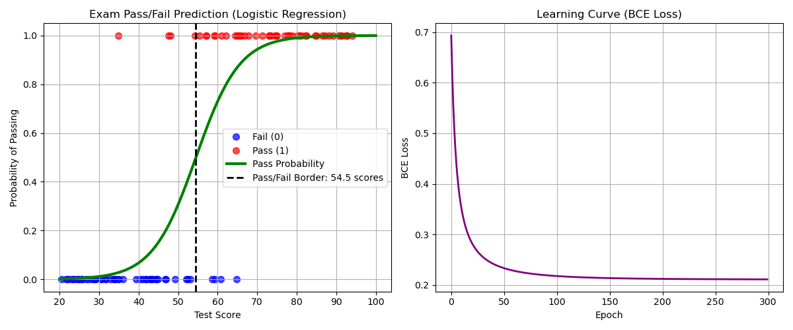

# ロジスティック回帰 (Logistic Regression) From Scratch

本ディレクトリでは，分類問題の基礎となる **ロジスティック回帰 (Logistic Regression)** を，NumPyを用いて完全にスクラッチで実装しています．テスト点数からその試験の「合否」を二値分類で予測します．

---

## アルゴリズムの概要

ロジスティック回帰は，線形モデルの出力を **シグモイド関数 (Sigmoid Function)** に通すことで，出力を $[0, 1]$ の範囲（確率値）に写像します．

$$z = w \cdot X + b$$

$$p = \sigma(z) = \frac{1}{1 + e^{-z}}$$

予測確率 $p$ が $0.5$ 以上であればクラス $1$（合格），それ未満であればクラス $0$（不合格）と判定します．

### 1. 損失関数 (Loss Function)
モデルの予測確率と正解ラベルの不一致度を測るため，**バイナリ交差エントロピー損失 (Binary Cross Entropy Loss: BCE)** を使用します．

$$Loss = -\frac{1}{N} \sum_{i=1}^{N} \left[ y^{(i)} \log(p^{(i)}) + (1 - y^{(i)}) \log(1 - p^{(i)}) \right]$$

※実装上は，$\log(0)$ によるゼロ除算エラーを防ぐため，予測確率 $p$ に微小な値 $10^{-15}$ を加算しています．

### 2. パラメータの更新規則 (勾配降下法)
BCE損失に対する重み $w$ とバイアス $b$ の偏微分（勾配）は，連鎖律（Chain Rule）を用いて次のように綺麗に求まります．

$$\frac{\partial Loss}{\partial w} = \frac{1}{N} \sum_{i=1}^{N} (p^{(i)} - y^{(i)}) \cdot X^{(i)}$$

$$\frac{\partial Loss}{\partial b} = \frac{1}{N} \sum_{i=1}^{N} (p^{(i)} - y^{(i)})$$

更新ルール（学習率を $\eta$ とします）：

$$w \leftarrow w - \eta \cdot \frac{\partial Loss}{\partial w}$$

$$b \leftarrow b - \eta \cdot \frac{\partial Loss}{\partial b}$$

---

## データセットについて

本実装では，試験の合否を想定した以下の人工データセットを作成して使用しています．

- **特徴量 (X)**: 20点から95点までのテスト点数（100人分）．
- **ターゲット (y)**: 55点を合格・不合格の確率的な境界とし，以下のロジックでランダムに合否（0:不合格，1:合格）を決定します．
  $$z = 0.2 \times (score - 55)$$
  $$probs = \sigma(z)$$
- **データ標準化**:
  学習率を大きく設定できるようにし，学習プロセスの安定性と超高速な収束を図るため，テスト点数 $X$ を標準化（平均0，標準偏差1にスケーリング）しています．

---

## 実行結果と考察

モデルを学習率 $\eta = 0.5$，エポック数 $300$ で学習させた結果，損失値（BCE Loss）はスムーズに低下し，最終的に最適な分類モデルが獲得できました．

以下は，実行によって生成された可視化グラフです．



### グラフの解説
- **左図 (Exam Pass/Fail Prediction)**: 
  青いドットが実際の不合格者，赤いドットが合格者です．緑色の曲線は，学習されたモデルが算出するテスト点数に対する合格確率（Pass Probability）を表しています．
  黒い破線で示された **決定境界 (Pass/Fail Border)** は約 $55.0$ 点前後に自動的に引かれており，確率がちょうど $50\%$ となる点数とデータ全体の境界が非常によく一致していることが確認できます．
- **右図 (Learning Curve)**: 
  学習の進捗（エポック数）に伴うBCE損失の推移を表しています．急激に損失が減少し，約 $50$ エポック前後でほぼ最小値に達して安定していることが分かります．

---

## 実行方法

ルートディレクトリから，以下のコマンドを実行します．

```bash
python 02_logistic_regression/logistic_regression.py
```
