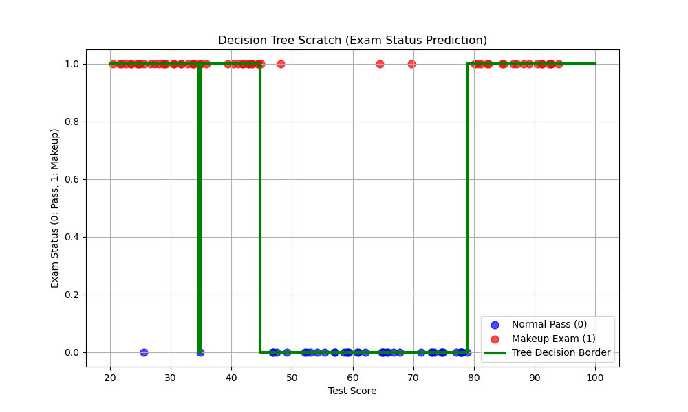

# 決定木 (Decision Tree) From Scratch

本ディレクトリでは，機械学習におけるノンパラメトリックな教師あり学習手法である **決定木 (Decision Tree) 分類器** を，NumPyを用いて完全にスクラッチで実装しています．

線形分類モデル（ロジスティック回帰など）では分類できない，複雑で非線形な決定境界をシンプルな「If-Then」ルール（条件分岐）によって自動的に獲得します．

---

## アルゴリズムの概要

決定木は，データを最も綺麗に分割（クラスが均一になるように分類）できる特徴量と閾値（境界値）を再帰的に見つけ出し，ツリー（木）構造を構築します．

### 1. 不純度指標: エントロピー (Entropy)
データの「雑乱さ」や「不純度」を評価する指標として **エントロピー (Entropy)** を計算します．クラス $c$ の割合を $p_c$ とすると，エントロピー $H(y)$ は以下のように計算されます．

$$H(y) = - \sum_{c} p_c \log_2(p_c)$$

すべてのデータが同一クラスに属する場合，不純度は最も低くなり $H(y) = 0$ となります．逆に，クラスの割合が半々のとき，不純度は最大（$H(y) = 1$）になります．

### 2. 分割基準: 情報利得 (Information Gain)
データをある閾値で左側（$y_{left}$）と右側（$y_{right}$）に分割した際，どれだけ不純度が減少したかを評価する指標が **情報利得 (Information Gain)** です．親ノードのデータ数を $N$，左右の子ノードのデータ数をそれぞれ $N_{left}$，$N_{right}$ とします．

$$IG = H(y_{parent}) - \left( \frac{N_{left}}{N} H(y_{left}) + \frac{N_{right}}{N} H(y_{right}) \right)$$

本実装では，すべてのデータ点そのものを閾値候補とし，情報利得 $IG$ が最大となる最適な閾値を全探索（グリッドサーチ）によって決定します．

### 3. 木の再帰的構築と停止基準
モデルは，最適な閾値でデータを二分割し，分割されたデータに対してさらに再帰的（Recursive）にツリーを伸ばします．過学習を防ぐため，以下の **停止基準 (Stopping Criteria)** に達した時点で分割を停止し，そのノードを葉ノード（Leaf Node，予測結果を出力する末端）とします．
- 木の深さが **最大深さ (max_depth=3)** に達したとき．
- ノード内のサンプル数が **最小サンプル数 (min_samples_split=2)** 未満になったとき．
- ノード内のデータが完全に一色（不純度0，即ち同一クラスのみ）になったとき．

---

## データセットについて

本実装では，非線形な決定境界を持つ以下の人工データセットを作成して使用しています．

- **特徴量 (X)**: 20点から95点までのテスト点数（100人分）．
- **ターゲット (y)**: 段階的な境界を設定します．
  - 「45点未満」または「80点より大きい」人は追試対象（1:Makeup Exam）．
  - その間の「45点以上80点以下」の人は一発合格（0:Normal Pass）．
  - 現実のデータに近づけるため，約 $5\%$ の割合でランダムなノイズ（例外値）を混入させています．
- **非線形境界**: 
  このデータセットの決定境界は「点数が低すぎても高すぎても追試」という二峰性（非線形）になっており，ロジスティック回帰のような単純な直線的モデルでは分類不可能です．

---

## 実行結果と考察

最大深さを `max_depth=3` に設定した自作決定木モデルを学習させた結果，複雑な非線形境界を捉えることに成功しました．

以下は，実行によって生成された可視化グラフです．



### グラフの解説
- **散布図と決定境界 (Tree Decision Border)**: 
  青いドットが合格者，赤いドットが追試対象者です．緑色の太線が決定木によって学習された予測境界（ステップ関数状の境界線）を示しています．
  決定木は，データの中央部分（45点付近から80点付近まで）を「合格（0）」，その両端を「追試（1）」と見事に捉えています．
  `plt.step` で描画された境界線が示す通り，決定木モデルの最大の特徴である「パキッとした段階的な条件分岐」が美しく再現されていることが視覚的に理解できます．

---

## 実行方法

ルートディレクトリから，以下のコマンドを実行します．

```bash
python 03_decision_tree/decision_tree.py
```
