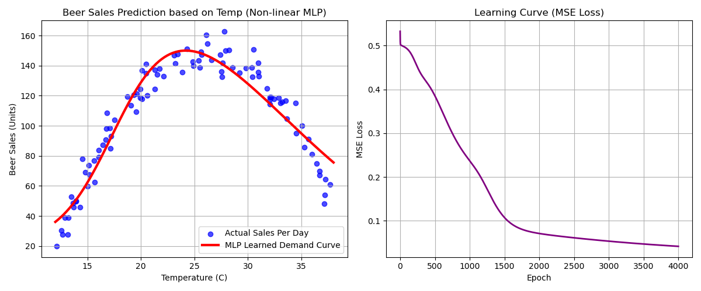

# 多層パーセプトロン (MLP: Multilayer Perceptron) From Scratch

本ディレクトリでは，ディープラーニング（深層学習）の基礎となる **多層パーセプトロン (Multilayer Perceptron: MLP)** を，NumPyによる行列演算を用いて完全にスクラッチで実装しています．

隠れ層を持つニューラルネットワークを構築し，誤差逆伝播法（Backpropagation）の勾配計算を手動の数式解法から実装に落とし込んでいます．非線形な関数近似（回帰タスク）に挑戦します．

---

## ネットワーク構成とアルゴリズムの概要

本モデルは，以下の 3 層構造ニューラルネットワーク（回帰モデル）となっています．

- **入力層**: 1次元（$X$: 気温）
- **隠れ層**: 8次元（活性化関数: **シグモイド関数 $\sigma$**）
- **出力層**: 1次元（活性化関数: なし（恒等写像））

### 1. 順伝播 (Forward Propagation)
入力行列 $X$ (次元: $1 \times N$) に対し，順方向の計算を行います．

$$Z_1 = W_1 \cdot X + b_1 \quad (\text{隠れ層の線形変換，} W_1: 8 \times 1, b_1: 8 \times 1)$$

$$A_1 = \sigma(Z_1) = \frac{1}{1 + e^{-Z_1}} \quad (\text{シグモイド活性化，} A_1: 8 \times N)$$

$$Z_2 = W_2 \cdot A_1 + b_2 \quad (\text{出力層の線形変換，} W_2: 1 \times 8, b_2: 1 \times 1)$$

$$A_2 = Z_2 \quad (\text{恒等写像の予測値，} A_2: 1 \times N)$$

### 2. 誤差逆伝播法 (Backpropagation) による勾配の手動計算
損失関数には **平均二乗誤差 (MSE)** を使用します．

$$Loss = \frac{1}{2N} \sum_{i=1}^{N} (A_2^{(i)} - y^{(i)})^2$$

連鎖律（Chain Rule）を用いて，各層のパラメータに対する勾配を行列演算の形式で導出します．

- **出力層の誤差勾配 ($dZ_2$)**:
  $$dZ_2 = \frac{\partial Loss}{\partial Z_2} = \frac{1}{N} (A_2 - y)$$
- **出力層パラメータの勾配 ($dW_2, db_2$)**:
  $$dW_2 = dZ_2 \cdot A_1^T, \quad db_2 = \sum_{\text{columns}} dZ_2$$
- **隠れ層への誤差伝播 ($dA_1$)**:
  $$dA_1 = W_2^T \cdot dZ_2$$
- **隠れ層の活性化前誤差勾配 ($dZ_1$)**:
  シグモイド関数の微分 $\sigma'(Z_1) = A_1 \odot (1 - A_1)$ を乗算します（$\odot$ は要素ごとの積）．
  $$dZ_1 = dA_1 \odot (A_1 \odot (1 - A_1))$$
- **隠れ層パラメータの勾配 ($dW_1, db_1$)**:
  $$dW_1 = dZ_1 \cdot X^T, \quad db_1 = \sum_{\text{columns}} dZ_1$$

### 3. 最急降下法によるパラメータの更新
計算された勾配に学習率 $\eta$ を掛けて，全ての重みとバイアスを更新します．

$$W_1 \leftarrow W_1 - \eta \cdot dW_1, \quad b_1 \leftarrow b_1 - \eta \cdot db_1$$
$$W_2 \leftarrow W_2 - \eta \cdot dW_2, \quad b_2 \leftarrow b_2 - \eta \cdot db_2$$

---

## データセットについて

本実装では，単純な直線では近似できない山型の非線形関係を持つ以下の人工データセットを作成して使用しています．

- **特徴量 (X)**: 12℃ から 38℃ までの日ごとの気温データ（100日分）．
- **ターゲット (y)**: 以下の二次関数に基づき，ビールの売上本数（単位: 本）を算出．さらに，天候やイベントによるバラつきを模擬したガウスノイズ（平均0，標準偏差8）を付加．
  $$sales = 150.0 - 0.7 \times (temp - 26)^2 + noise$$
- **入力・出力の標準化**:
  ニューラルネットワークの勾配消失や極小解へのスタック（局所解へのトラップ）を防ぐため，**入力（気温）とターゲット（売上）の双方に対して標準化（平均0，標準偏差1）を適用** しています．予測時には元のスケールに逆変換（Inverse Transform）してプロットします．

---

## 実行結果と考察

隠れ層 $8$ 次元のMLPモデルを学習率 $\eta = 0.1$，エポック数 $4000$ で学習させた結果，損失値（MSE Loss）はスムーズに低下し，山型の非線形パターンを極めて滑らかに近似することに成功しました．

以下は，実行によって生成された可視化グラフです．



### グラフの解説
- **左図 (Beer Sales Prediction based on Temp)**: 
  青いドットが毎日の実際の売上本数です．赤い曲線がMLPが学習した「需要予測曲線」です．
  気温 $26$℃ 付近をピークに売上が最大化し，それより寒くても暑すぎても（熱中症警戒や外出自粛などの影響を想定）売上が低下する山型の非線形カーブを，1つの隠れ層を持つMLPが完璧にフィットできていることが視覚的に確認できます．
- **右図 (Learning Curve)**: 
  学習の進捗（エポック数）に伴うMSE損失の推移を表しています．エポック数が進むにつれて，損失が非常に滑らかに低下し，約 $1500$ エポック以降で綺麗に収束している様子が分かります．

---

## 実行方法

ルートディレクトリから，以下のコマンドを実行します．

```bash
python 04_deep_learning/mlp.py
```
