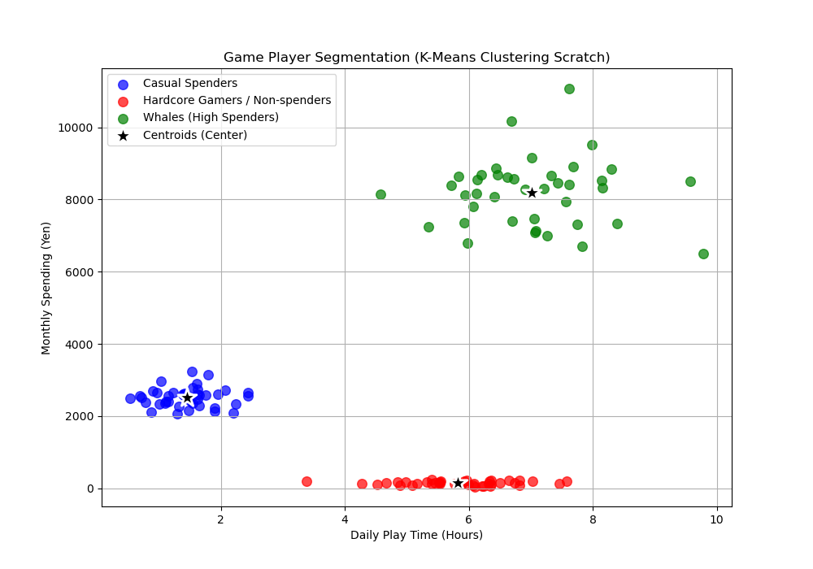

# K-Means クラスタリング From Scratch

本ディレクトリでは，代表的な非教師あり学習（Unsupervised Learning）アルゴリズムである **K-Means クラスタリング** を，NumPyを用いて完全にスクラッチで実装しています．

データ全体の構造を自動分析し，ラベルのないゲームプレイヤーの利用データを特徴量に基づいて 3 つのグループ（クラスタ）に自動的にセグメンテーションします．

---

## アルゴリズムの概要

K-Meansは，事前に指定したクラスタ数 $K$ に基づき，データを互いに重ならない $K$ 個のグループに分割する反復アルゴリズムです．

### 1. 距離計算（ユークリッド距離）
2つのデータ点 $x_1$，$x_2$ 間の類似性を測定するため，**ユークリッド距離 (Euclidean Distance)** を使用します．

$$d(x_1, x_2) = \sqrt{\sum_{j=1}^{M} (x_{1j} - x_{2j})^2}$$

### 2. アルゴリズムの実行ステップ
以下の反復処理によって最適な重心（Centroids）の位置を決定します．

1. **重心の初期化**: 
   データセットの中から重複なしでランダムに $K$ 個の点を選択し，初期の重心 $\mu_1, \mu_2, \dots, \mu_K$ とします．
2. **クラスタの割り当て (Assignment Step)**: 
   各データ点 $x^{(i)}$ に対して，すべての重心との距離を計算し，最も距離が短い重心のクラスタ $c^{(i)}$ に割り当てます．
   $$c^{(i)} \leftarrow \arg\min_{k} d(x^{(i)}, \mu_k)$$
3. **重心の更新 (Update Step)**: 
   各クラスタ $k$ に割り当てられたすべてのデータ点の平均値（重心）を計算し，新しい重心の位置とします．
   $$\mu_k \leftarrow \frac{1}{|S_k|} \sum_{x \in S_k} x$$
   ここで，$S_k$ はクラスタ $k$ に割り当てられたデータ点の集合，$|S_k|$ はそのサンプル数です．
4. **収束判定**: 
   重心の位置が前回のステップから変化しなくなった場合（または最大反復回数 `max_iters=100` に達した場合），完全に収束したとみなしてループを終了します．

---

## データセットについて

本実装では，ゲーム内のユーザー行動を模した以下の人工データセットを作成して使用しています．

- **特徴量**: 
  1. `Daily Play Time`: 1日あたりの平均プレイ時間（単位: 時間）．
  2. `Monthly Spending`: 月間の課金額（単位: 円）．
- **プレイヤーの3つの隠れたグループ (合計120人分)**:
  - **グループA (無課金ヘビー)**: プレイ時間が長く課金はほぼゼロ（平均プレイ時間: 6時間，平均課金: 150円）．
  - **グループB (重課金ライト)**: プレイ時間は短く課金額は高め（平均プレイ時間: 1.5時間，平均課金: 2,500円）．
  - **グループC (廃課金トップ)**: プレイ時間が長く課金額も極めて高額（平均プレイ時間: 7時間，平均課金: 8,000円）．
- **データ標準化の重要性**:
  プレイ時間（スケール: 0〜10）と課金額（スケール: 0〜10000）で単位と数値の規模が全く異なります．これをそのまま距離計算に使用すると，**距離が課金額の大きさに支配されてしまい，プレイ時間の差が無視されてしまいます．**
  そのため，特徴量ごとに平均0，標準偏差1に標準化を施した上でクラスタリングを実行しています．

---

## 実行結果と考察

クラスタ数 $K=3$ に設定してK-Meansを実行した結果，プレイヤーの行動パターンを綺麗に分類できました．

以下は，実行によって生成された可視化グラフです．プロット時には元のスケール（時間・円）に逆変換しているため，非常に直感的な解釈が可能です．



### グラフの解説
- **3つのセグメンテーションされたクラスタ**:
  - **青色 (Casual Spenders)**: プレイ時間は短いが，適度な課金をするグループBが正しく抽出されています．
  - **赤色 (Hardcore Gamers / Non-spenders)**: プレイ時間が非常に長いものの，課金をしないグループAが分類されています．
  - **緑色 (Whales / High Spenders)**: プレイ時間が非常に長く，月間課金額も圧倒的に高い廃課金グループCが明確に区別されています．
- **黒い星マーク (Centroids)**:
  各クラスタに属するデータの平均位置（重心）を示しています．アルゴリズムの反復更新により，それぞれのグループの中心点へ綺麗に移動して収束していることが視覚的に理解できます．

---

## 実行方法

ルートディレクトリから，以下のコマンドを実行します．

```bash
python 05_kmeans/kmeans.py
```
