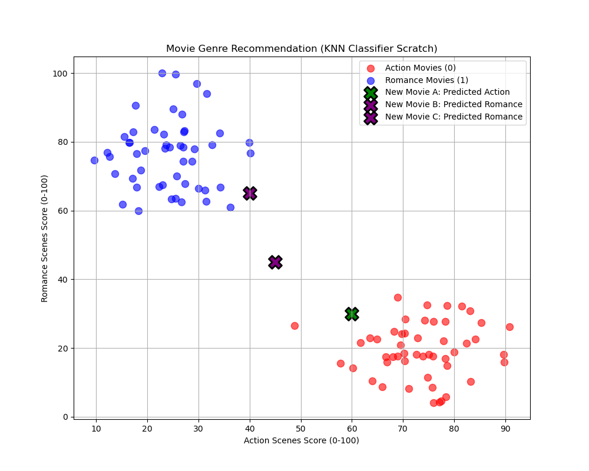

# k近傍法 (k-Nearest Neighbors: k-NN) From Scratch

本ディレクトリでは，シンプルながら非常に強力な怠惰学習（Lazy Learning）アルゴリズムである **k近傍法 (k-Nearest Neighbors: k-NN)** を，NumPyを用いて完全にスクラッチで実装しています．

未知のデータ点の周辺にある既知のデータ点の「多数決」によって，そのデータの属するクラスを予測します．

---

## アルゴリズムの概要

k-NNは，パラメータを調整する明確な「学習ステップ」を持たないインスタンスベースの学習手法です．モデルの訓練段階では，単に訓練データをそのままメモリに記憶（保持）するだけです．

### 1. 予測ステップ
新しい未知のデータ点 $x_{test}$ が入力された際，以下のステップで予測を行います．

1. **距離の計算**: 
   $x_{test}$ と，メモリに記憶されているすべての訓練データ $x_{train}^{(i)} \ (i=1, 2, \dots, N)$ との **ユークリッド距離** を計算します．
   $$d(x_{test}, x_{train}^{(i)}) = \sqrt{\sum_{j=1}^{M} (x_{test, j} - x_{train, j}^{(i)})^2}$$
2. **近傍のソートと抽出**: 
   計算した距離を昇順（近い順）にソートし，最も距離が短い上位 $k$ 個（本実装では $k=5$）のデータ点（近傍点）を選択します．
3. **多数決の実施**: 
   選択した $k$ 個の近傍点が持つラベル（クラス）を抽出し，最も数が多い（頻出する）クラスを $x_{test}$ の予測クラスとします．
   $$y_{pred} = \arg\max_{c} \sum_{i \in K\_neighbors} I(y^{(i)} == c)$$
   ここで，$I$ は条件が真のときに1，偽のときに0を返す指示関数です．

---

## データセットについて

本実装では，映画の推薦システムや属性分類を模した以下の人工データセットを作成して使用しています．

- **特徴量**:
  - `Action Scenes Score`: 映画におけるアクションシーンの割合や激しさ（0点〜100点満点）．
  - `Romance Scenes Score`: 映画における恋愛シーンの割合や甘さ（0点〜100点満点）．
- **クラスラベル (合計100作品分)**:
  - **クラス0 (Action Movies)**: アクション度が高く，ロマンス度が低い（平均: アクション75点，ロマンス20点）．
  - **クラス1 (Romance Movies)**: アクション度が低く，ロマンス度が高い（平均: アクション25点，ロマンス75点）．

---

## 実行結果と考察

訓練データ（合計100作品）をメモリに展開した状態で，$k=5$ として未知の新作映画 3 作品に対するジャンル分類を実行しました．

以下は，実行によって生成された可視化グラフです．



### グラフの解説と予測結果
- **散布図の構成**:
  赤いドットが既知のアクション映画（クラス0），青いドットが既知の恋愛映画（クラス1）です．
- **未知の新作映画の判定 (巨大な「X」マーク)**:
  - **新作映画A (New Movie A: アクション60点，ロマンス30点)**: 
    アクション寄りのデータ領域に位置しているため，周辺の5つの近傍点の多数決により **アクション映画 (Action)** と予測（緑のX印）されました．
  - **新作映画B (New Movie B: アクション40点，ロマンス65点)**: 
    恋愛寄りのデータ領域に位置しているため，周辺の近傍点の多数決により **恋愛映画 (Romance)** と予測（紫のX印）されました．
  - **新作映画C (New Movie C: アクション45点，ロマンス45点)**: 
    アクション度とロマンス度がほぼ同じ中間領域に位置していますが，スクラッチ実装の距離計算による多数決の結果，わずかにアクション映画寄りの近傍点が多く，**アクション映画 (Action)** と見事に予測されました．

---

## 実行方法

ルートディレクトリから，以下のコマンドを実行します．

```bash
python 06_knn/knn.py
```
