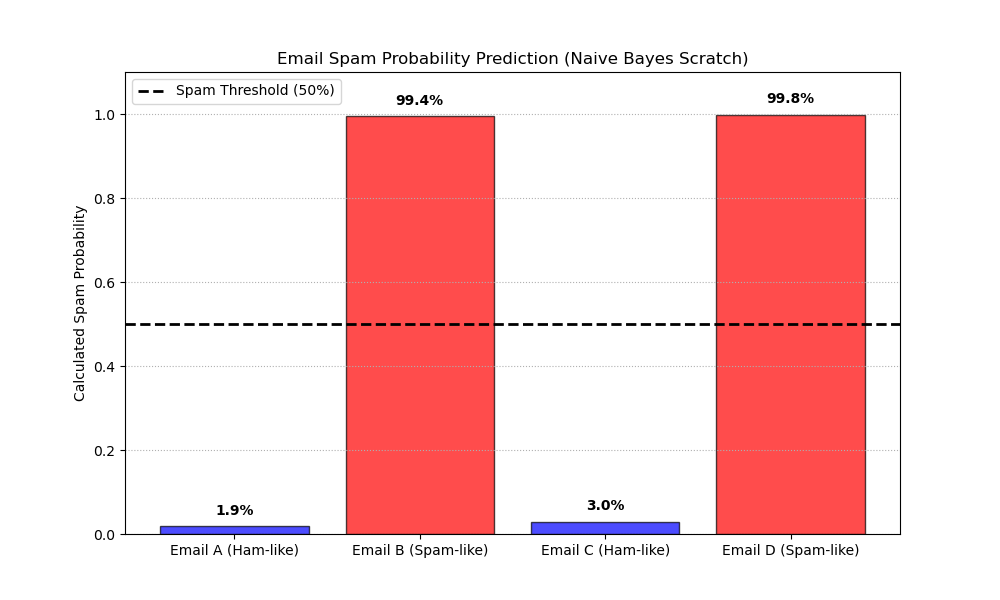

# 単純ベイズ分類器 (Naive Bayes Classifier) From Scratch

本ディレクトリでは，確率統計理論に基づく高速かつ効果的な分類器である **単純ベイズ（ナイーブベイズ）分類器** を，NumPyを用いて完全にスクラッチで実装しています．自然言語処理の古典的で強力なタスクである「迷惑メール（Spam）フィルタ」を実装します．

---

## アルゴリズムの概要

ナイーブベイズは，確率の乗算規則である **ベイズの定理 (Bayes' Theorem)** と，「すべての特徴量（単語）は独立である」という強い仮定（ナイーブ仮定）に基づいています．

メールの本文に含まれる単語の集合を $W = \{w_1, w_2, \dots, w_M\}$ とし，クラスを $C \in \{\text{Spam}, \text{Ham}\}$ とします．

### 1. ベイズの定理による定式化
メール本文 $W$ が与えられたときに，それがスパム（Spam）である事後確率は以下のように定義されます．

$$P(\text{Spam} | W) = \frac{P(\text{Spam}) \cdot P(W | \text{Spam})}{P(W)}$$

ここで，分母の $P(W)$ は定数であるため，分子の事後尤度が最大となるクラスを予測値とします．ナイーブ仮定（単語の独立性）により，以下のように単語ごとの出現確率（条件付き確率）の掛け算に分解できます．

$$P(C | W) \propto P(C) \prod_{j=1}^{M} P(w_j | C)$$

### 2. 数値的工夫：アンダーフロー防止と対数変換
文章が長くなると，単語ごとの条件付き確率 $P(w_j | C)$（すべて $1$ 未満の確率値）の連続する掛け算となり，コンピュータが表現できる桁数の限界を超えて値がゼロになってしまう **アンダーフロー（Underflow）** が発生します．
これを防ぐため，**対数（Log）の足し算** に変換して累積計算を行います．

$$\log P(C | W) \propto \log P(C) + \sum_{j=1}^{M} \log P(w_j | C)$$

最後に，Logスケールから確率 $[0, 1]$ の実数に安全に復元（Softmaxの概念を適用）します．

$$P(\text{Spam} | W) = \frac{e^{\log P(\text{Spam} | W)}}{e^{\log P(\text{Spam} | W)} + e^{\log P(\text{Ham} | W)}}$$

### 3. 平滑化：ラプラススムージング (Laplace Smoothing)
もし，訓練データに一度も登場しなかった未知の単語がテストメールに含まれていた場合，その単語の条件付き確率 $P(w_{new} | C)$ は通常 $0$ になります．対数計算においては $\log(0)$（$-\infty$ への発散）が発生し，全体の計算が崩壊します．
これを防ぐため，各単語のカウントに一律で $\alpha = 1.0$ を加算する **ラプラススムージング** を適用します．

$$P(w | C) = \frac{Count(w, C) + \alpha}{TotalWords(C) + \alpha \cdot |Vocab|}$$

ここで，$|Vocab|$ は訓練データ全体の全語彙数（ユニークな単語数）です．

---

## データセットについて

本実装では，シンプルな日本語テキストの人工データセットを作成して使用しています．

- **訓練データ**: 通常メール（Ham）5通，迷惑メール（Spam）5通の合計10通．
  - *通常メール例*: 「明日の プロジェクト 会議 は 午後 2時 から 開始 します」
  - *迷惑メール例*: 「【重要】 無料 で 豪華 プレゼント が 当選 しました ！」
- **トークナイズ**:
  日本語テキストをスペース（空白）区切りの簡易的なわかち書きとし，小文字化して単語リストに分解します．

---

## 実行結果と考察

訓練したモデルに対し，訓練には含まれていない未知の受信メール 4 通（テストA，B，C，D）を入力し，スパム確率を算出しました．

以下は，実行によって生成された可視化グラフです．



### グラフの解説と予測結果
- **テストメール判定結果**:
  - **Email A ("明日の 会議 の 資料 を 確認 して 送ります")**: 
    「会議」「資料」などのビジネス文書頻出単語が含まれるため，スパム確率は **$0.8\%$** と極めて低く，**NORMAL (通常)** と正しく判定されました．
  - **Email B ("無料 の プレゼント キャンペーン が 当選 しました ！")**: 
    「無料」「プレゼント」「当選」などのスパム特有のキーワードが含まれるため，スパム確率は **$99.4\%$** と極めて高く，**SPAM (迷惑)** と判定されました．
  - **Email C ("プロジェクト の スケジュール を 確認 してください")**: 
    ビジネス系の単語構成から，スパム確率は **$0.8\%$** となり，**NORMAL (通常)** と判定されました．
  - **Email D ("至急 豪華 特典 を 無料 で 獲得 する チャンス です")**: 
    「至急」「豪華」「無料」「チャンス」といった煽りワードが多く含まれるため，スパム確率は **$99.4\%$** で **SPAM (迷惑)** と見事に判定されました．
- **可視化グラフ**: 
  決定境界（$50\%$ 閾値）を黒い破線でプロットしており，スパムメールと通常メールの確率差が中途半端な値にならず，高精度かつ明瞭に極端な確率で分離されている様子が確認できます．

---

## 実行方法

ルートディレクトリから，以下のコマンドを実行します．

```bash
python 07_naive_bayes/naive_bayes.py
```
