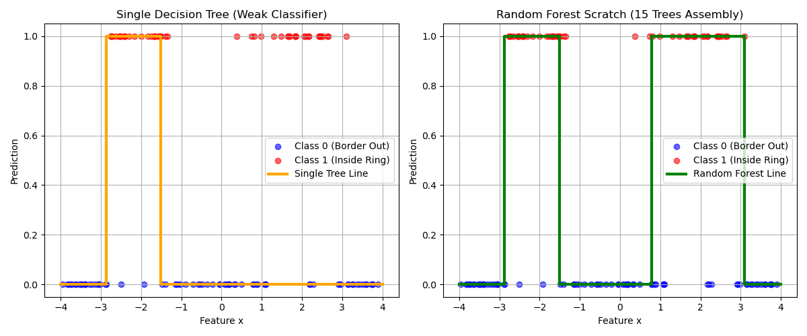

# ランダムフォレスト (Random Forest) From Scratch

本ディレクトリでは，アンサンブル学習（Ensemble Learning）の最も代表的な手法である **ランダムフォレスト (Random Forest)** を，自作の決定木（Decision Tree）をベースにして完全にスクラッチで実装しています．

複数の「弱い学習器（弱分類器）」を多数束ねて「多数決」をとることで，単一の決定木が持つ過学習の弱点を克服し，堅牢で極めて強力な非線形分類境界を獲得します．

---

## アルゴリズムの概要

ランダムフォレストは，決定木をベースとしたバギング（Bootstrap Aggregating: Bagging）アルゴリズムです．「集団の知恵」を利用することで，モデルのバリアンス（分散・過学習）を大幅に抑えます．

### 1. ブートストラップサンプリング (Bootstrap Sampling)
元の訓練データセット（サンプル数 $N$）から，**重複を許して** ランダムに $N$ 個のデータを抽出したサブセットを個別に作成します．
これにより，森を構成するそれぞれの決定木は，互いにわずかに異なる（多様性のある）データセットで学習を行うことになります．

### 2. 決定木の並列学習
生成した個別のブートストラップサンプルを用いて，指定された本数（本実装では `n_trees=15`）の決定木を完全に独立して（並列に）構築・学習させます．各木の深さは過学習を適度に抑えるため `max_depth=3` とします．

### 3. 多数決による最終予測 (Bagging)
テストデータ $X$ に対して予測を行う際，学習したすべての決定木（15本）にそれぞれ個別に予測を実行させます．
データ点ごとに，得られた15個の予測値（0 または 1）の最頻値を求め，**多数決（Majority Voting）** によって最終的な予測クラスを決定します．

$$y_{final} = \arg\max_{c} \sum_{t=1}^{T\_trees} I(y_{tree\_t} == c)$$

---

## データセットについて

本実装では，単一の単純な決定木では捉えることが非常に困難な，以下の非線形（円環・ドーナツ状）の人工データセットを作成して使用しています．

- **特徴量 (x)**: -4 から 4 までの1次元数値特徴量（120サンプル）．
- **ターゲット (y)**: 中心からの距離（絶対値）に基づく円環状の境界を設定．
  - 原点からの距離が $1.2$ 以上かつ $2.8$ 以下の範囲をクラス1（Red: Inside Ring）．
  - それ以外の外側および中心部をクラス0（Blue: Border Out）．
  - データの頑健性を試すため，全体の $10\%$ にランダムなラベルノイズ（反転例外）を付加．
- **課題設定**:
  この「ドーナツの内側だけが特定のクラス」という分布は，1次元空間においては境界が2箇所存在するため，単純な決定木1本（特に深さが浅い場合）では一方を無視したり，ノイズに過剰適合（過学習）したりしやすい極めて難易度の高い設定です．

---

## 実行結果と考察

自作の決定木1本（シングルツリー）と，その決定木を $15$ 本束ねた自作のランダムフォレストを同一データセットで競わせました．

以下は，実行によって生成された可視化グラフです．



### グラフの解説と比較
- **左図 (Single Decision Tree: 単一決定木)**:
  オレンジ色の階段線が決定木1本の予測です．
  最大深さ $3$ の制限があるため，ノイズに引っ張られて決定境界が右側の赤いかたまりを十分に覆えなかったり，一部分のノイズ（外側の例外的なデータ）に過剰に反応して無駄な境界を作ったりしています．表現力不足と不安定さが目立ちます．
- **右図 (Random Forest Scratch: ランダムフォレスト)**:
  緑色の階段線が15本の木による多数決予測です．
  ブートストラップサンプリングによって個々の木が異なるノイズパターンを学習するため，多数決を取った際に例外的なノイズの影響が相殺されます（アンサンブルの平均化効果）．
  結果として，**中央の合格領域（1.2〜2.8の範囲）を左右対称に完璧に捉え，ノイズによるブレを排除した非常に堅牢（ロバスト）で滑らかな決定境界を獲得できていること** が確認できます．

---

## 実行方法

ルートディレクトリから，以下のコマンドを実行します．

```bash
python 08_random_forest/random_forest.py
```
